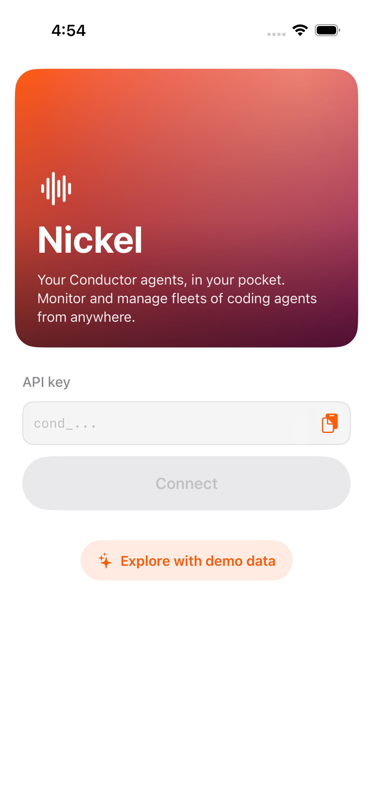
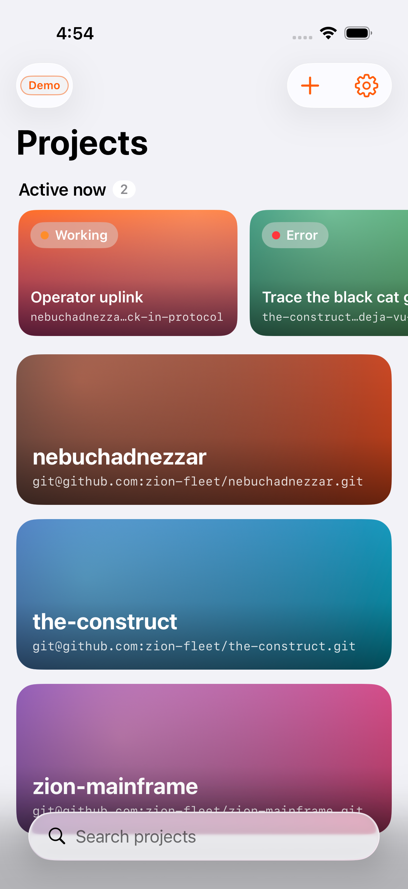
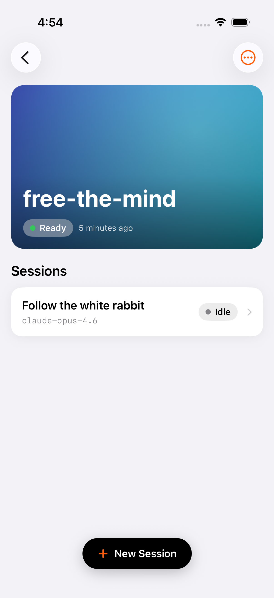
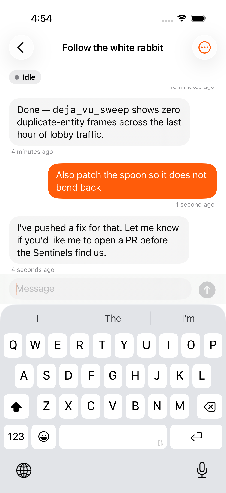

# Nickel

**Nickel** is an iOS companion app for [Conductor](https://www.conductor.build) — monitor and manage
your projects, cloud workspaces, and coding-agent sessions from your phone via the
[Conductor public API](https://api.conductor.build/v0/).

| Onboarding | Projects | Workspace | Agent chat |
|---|---|---|---|
|  |  |  |  |

## What it does

- **Sign in with your Conductor API key** (validated live, stored in the iOS Keychain) —
  or tap "Explore with demo data" for a fully mocked, no-network demo mode.
- **Active now** — a fleet strip at the top of the home screen surfaces every session
  currently working or erroring across *all* your projects, one tap from its chat — the
  desktop app's at-a-glance view, on the phone.
- **Projects** — browse all projects with search, pagination, and pull-to-refresh.
- **Workspaces** — per-project list with live status dots (initializing / ready /
  sleeping / archived / updating), create new workspaces (branch, agent, model) — on a
  project or straight from any repository URL — rename, archive, and share the desktop
  deep link ("Open on Mac").
- **Agent sessions** — chat with a running agent from your phone: full transcript
  (unrecognized event payloads render as tappable raw-JSON chips), send follow-up
  messages (with queued-delivery state), watch the working indicator, and cancel runaway
  turns. Status and transcript poll at 3s while working, 10s while idle.

## Building

Requirements: Xcode 26+, [XcodeGen](https://github.com/yonaskolb/XcodeGen) (`brew install xcodegen`).

```bash
xcodegen generate
open Nickel.xcodeproj   # or:
xcodebuild -project Nickel.xcodeproj -scheme Nickel \
  -destination 'platform=iOS Simulator,name=iPhone 17 Pro' build
```

Tests (111 unit tests + an end-to-end demo-mode UI test that walks every screen):

```bash
xcodebuild -project Nickel.xcodeproj -scheme Nickel \
  -destination 'platform=iOS Simulator,name=iPhone 17 Pro' test
```

## Architecture

Pure SwiftUI + Observation, iOS 17+, zero third-party dependencies.

- `Nickel/API/` — `ConductorClient` protocol with two conformances:
  `LiveConductorClient` (URLSession + bearer auth) and `MockConductorClient` (seeded
  in-memory demo world used by demo mode, previews, and tests). `JSONValue` models the
  API's untyped message `content`; `ConductorError` normalizes the API's
  `StructuredError` body.
- `Nickel/App/` — `AppSession` auth state machine (unauthenticated / live /
  demo), `Theme` (Conductor orange, status colors, monospaced identifiers).
- `Nickel/Features/` — one folder per screen, `@Observable` view models.
- `Nickel/Support/` — `KeychainStore`, `Loadable`, polling helper, ISO-8601
  formatters.

The project file is generated — edit `project.yml`, never the `.xcodeproj`, and re-run
`xcodegen generate` after adding files. See [PLAN.md](PLAN.md) for the full design and
API reference.

> The Conductor API is marked experimental (`x-conductor-stability: experimental`);
> endpoints may change.
